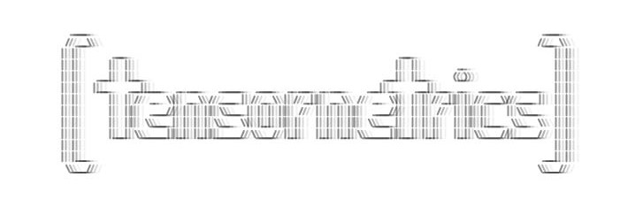

<p align="center">
  
</p>

## Network Models with Torch for R


This R package implements algorithms using **Torch for R** to estimate psychometric network models. Currently, the package supports:

- **Latent Network Models (LNM)**
- **Residual Network Models (RNM)**
- **Random Effects Meta-analytic Gaussian Network Aggregation (MAGNA)** (Beta Version Now Available!)
- **Panel G Models** (Coming Soon)

For more information on the theory behind these models, please refer to the following publications:  
1) LNM and RNM: [Estimation of Network Models with Latent Variables and Residual Covariances](https://doi.org/10.1007/s11336-017-9557-x)
2) MAGNA: [Meta-analytic Gaussian Network Aggregation](https://doi.org/10.1007/s11336-021-09764-3)
3) Panel G Models: [Psychometric Network Models from Time Series and Panel Data](https://doi.org/10.1007/s11336-020-09697-3)

## Example: Estimation of a Latent Network Model

Below is a basic example using the `tensor_lnm` function to estimate a latent network model on the `StarWars` dataset from the **psychonetrics** package.

```r
library(psychonetrics)

# Load the dataset
data('StarWars')

# Define the latent structure
lambda <- matrix(0, 10, 3)
lambda[1:4,1] <- 1
lambda[c(1,5:7),2] <- 1
lambda[c(1,8:10),3] <- 1

# Set observed and latent variables
observedvars <- colnames(StarWars[,1:10])
latents <- c('Prequels','Originals','Sequels')

# Estimate the latent network model using Torch
lnm <- tensor_lnm(data=StarWars[1:10], lasso=FALSE, lambda=lambda, vars=observedvars, latents=latents, device=torch_device('cpu'),identification = 'variance')

# Fit the model
lnm$fit(verbose=TRUE)
```

## More Examples

For more examples, one can take a look at the files `torch_lnm_example_code.R` and `torch_rnm_example_code.R` for more details. Both files have been annotated
to explain the what and how behind the fitting of both models. 


